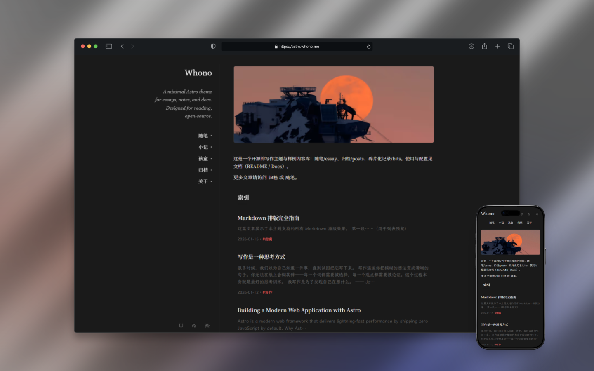

# astro-whono


一个极简双栏的 Astro 主题项目，面向个人写作与轻量内容发布。

## 简介

- 双栏布局 + 移动端适配
- 内容集合：posts / essay / bits / kids
- RSS 聚合与分栏订阅
- 浅色 / 深色模式 + 阅读模式
- 单一样式入口，排版一致

## 演示

- 在线预览：https://astro.whono.me
- 演示截图：
  - 浅色：`public/preview-light.png`
  - 深色：`public/preview-dark.png`




## 运行环境

- Node.js 22.12+（推荐使用 .nvmrc 指定版本）

## 快速开始

```bash
npm i
npm run dev
```

其他命令：

```bash
npm run build
npm run preview
npm run check
```
Windows（PowerShell）：如遇执行策略导致 npm.ps1 被拦截，可用 `cmd /c npm run ci` 或 `& npm.cmd run ci` 运行脚本（或改用 Git Bash/WSL）。

## 内容与路由

内容目录：
- 长文：`src/content/posts/*.md`
- 随笔：`src/content/essay/*.md`
- 小记：`src/content/bits/*.md`
- 孩童：`src/content/kids/index.md`
- 集合定义：`src/content.config.ts`

路由：
- `/` / `/posts/` / `/essay/` / `/bits/` / `/kids/` / `/about/`
- 详情页：`/posts/[...slug]/`、`/essay/[...slug]/`

## Frontmatter（最小约定）

posts / essay：
```yaml
title: My Post
date: 2026-01-01
draft: false
slug: optional
badge: optional # 仅 essay 使用
```

bits：
```yaml
date: 2026-01-01T12:00:00+08:00
draft: true
```

`draft: true` 的内容会从列表与 RSS 中过滤。

### 摘要与 description

- 首页/列表页的摘要会从正文自动生成（纯文本清洗后再做 3 行截断）。
- 可在正文中插入 `<!-- more -->`（或 `<!--more-->`）来指定列表摘要的截取位置。
- Frontmatter 的 `description` 为可选字段，主要用于 SEO/OG（meta description），不影响列表摘要。

示例：

```text
第一段……（用于列表预览）
<!-- more -->
后续正文……
```

## Content Blocks（内容协议块）

- Callout（有语法糖）：`:::type[title]` → `div.callout.{type} > p.callout-title + 内容`
- Figure/Caption（无语法糖，仅结构约定）：`figure > (img|picture) + figcaption`（figcaption 可选）
- Gallery（多图排版）：`ul.gallery > li > figure > (img|picture) + figcaption?`（无语法糖，仅结构约定；列数变体：`ul.gallery.cols-2` / `ul.gallery.cols-3`）
- Quote（引用）：标准 `blockquote`；可选 `<cite>` 作为来源标注，放在 blockquote 内最后一行
- Pullquote：不提供语法糖；如需强调可用 `blockquote.pullquote` 变体
- Code Block（渲染增强）：构建时对 `.prose pre.astro-code` / `.prose pre.shiki` 注入工具栏与复制按钮，并提供行号样式（非写作语法糖，作者无需额外写法）

边界：不提供内容层参数化（不通过 Markdown 语法控制 copy/行号/样式变体），固定 DOM 结构由渲染层实现。

## 写作/Markdown 扩展（Callout）

- 语法：`:::note[title] ... :::`
- 支持类型：note / tip / info / warning
- 标题写法：仅支持标准 `:::type[title]`（title 可选）
- 未知类型：降级为 note（内容不丢失）
- 不支持参数化（颜色 / 尺寸 / 变体 / 样式开关等）

示例：

```text
:::tip[一个小建议]
这里是正文……
:::
```

## Figure / Caption

使用标准结构：`figure > (img|picture) + figcaption`。figcaption 可选，不需要说明时不输出。

如需稳定钩子，可加 `figure.figure` 与 `figcaption.figure-caption`；不加也会命中样式。

```html
<figure class="figure">
  
  <figcaption class="figure-caption">这是一段图片说明。</figcaption>
</figure>
```

## 主题定制入口

- 站点配置入口：`site.config.mjs`（包含 url/title/brandTitle/author/description，Astro 配置与布局/RSS 均引用这里）
- 站点标题 / 页脚年份：`src/layouts/BaseLayout.astro`
- 侧栏导航 / 引言：`src/components/Sidebar.astro`
- 全局样式（含 Markdown 排版）：`src/styles/global.css`
- `.prose` 排版规则：`src/styles/components/prose.css`（由 global.css 聚合）
- 代码字体唯一入口：`src/styles/global.css` → `--font-mono`
- 代码高亮主题：`astro.config.mjs` → `markdown.shikiConfig.themes`

## Style Architecture

- `src/styles/global.css` 只负责 tokens / base 与 `@import` 聚合
- `src/styles/components/*` 负责组件与排版样式
- 选择器深度 ≤ 2，禁止页面级覆盖
- 组件 CSS 禁止写 hex/rgb（tokens 区允许）

## RSS

- `/rss.xml`（聚合）
- `/posts/rss.xml`、`/essay/rss.xml`

⚠️ 发布前请设置 `site.config.mjs` 的 `url` 为真实域名，`astro.config.mjs` 仅引用 `site.config.mjs`，不要在两处分别维护。

## 脚本

- 生成 bits 草稿：`npm run new:bit`
- 生成字体子集：`npm run font:build`（输出 `tools/charset-common.txt` 与 `public/fonts/lxgw-wenkai-lite-*.woff2`）

## 分支策略

- `main`：唯一长期分支 / 生产发布分支（Cloudflare Pages production branch 指向 `main`）
- `feature/*`：功能与碎改分支，完成后合并回 `main`
- `dev`：不再使用

## 开源与贡献

- License：MIT
- 欢迎提交 PR / Issue（建议先 `npm run check`）

## 第三方资源 / Credits

本项目包含字体 **LXGW WenKai（霞鹜文楷）**（Lite, Regular），作者 LXGW。
本项目自托管字体 **Noto Serif SC**（子集化，400/600）。

许可：**SIL Open Font License 1.1**（见 `public/fonts/OFL.txt`）。

使用的字体文件：
- `public/fonts/lxgw-wenkai-lite-latin.woff2`
- `public/fonts/lxgw-wenkai-lite-cjk-common.woff2`
- `public/fonts/lxgw-wenkai-lite-cjk-ext.woff2`
- `public/fonts/noto-serif-sc-400-latin.woff2`
- `public/fonts/noto-serif-sc-400-cjk-common.woff2`
- `public/fonts/noto-serif-sc-400-cjk-ext.woff2`
- `public/fonts/noto-serif-sc-600-latin.woff2`
- `public/fonts/noto-serif-sc-600-cjk-common.woff2`
- `public/fonts/noto-serif-sc-600-cjk-ext.woff2`

源字体（不入库）：`tools/fonts-src/LXGWWenKaiLite-Regular.woff2`、`tools/fonts-src/NotoSerifSC-Regular.ttf`、`tools/fonts-src/NotoSerifSC-SemiBold.ttf`

## 致谢

- 感谢 [elizen/elizen-blog](https://github.com/elizen/elizen-blog)，它是最初的设计蓝本
- 进一步追溯，其风格源于 Hugo 主题 [yihui/hugo-ivy](https://github.com/yihui/hugo-ivy)
